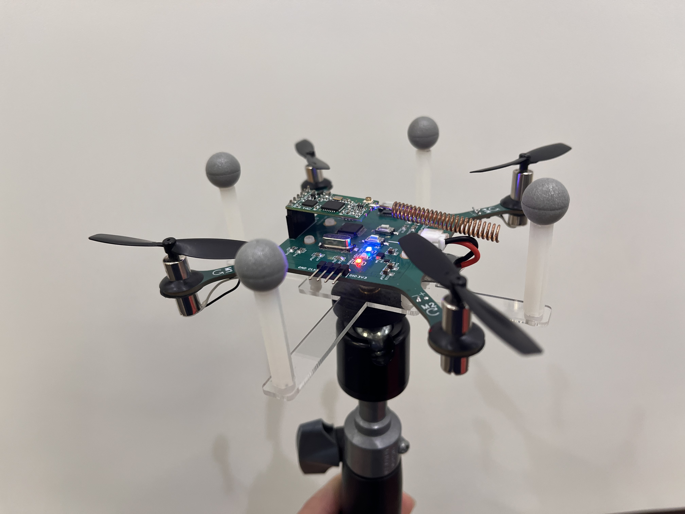

# LoRa-Wireless-Control-Drone

## Introduction

This project involves the design and fabrication of a quadcopter drone equipped with wireless signal transmission via LoRa to control its attitude. The drone's attitude control accuracy is validated using motion capture technology, ensuring precise real-time adjustments and performance evaluation. This system aims to demonstrate the capability of LoRa for long-range wireless communication in unmanned aerial vehicles (UAVs) while leveraging advanced motion capture techniques to improve and verify control precision.

---

## UAV Mechanical Structure

The system consists of the following components:
- STM32F103C8T6 microcontroller
- HC-14 module
- Four motors
- Battery

Refer to the provided diagram for the physical layout.



### Motor Directions:
- **M1**: Counterclockwise
- **M2**: Clockwise
- **M3**: Clockwise
- **M4**: Counterclockwise

---

## UAV Control

The UAV Control Module is responsible for enabling basic control of an Unmanned Aerial Vehicle (UAV) through a computer interface. This module allows UAV receives messages of certain format, which further interprets these messages and adjusts its attitude (e.g., pitch, roll, and yaw) accordingly.

### Message Format

- The computer sends messages to the UAV in the following format:

    ```
    <m1,m2,m3,m4>
    ```

  - `m1`, `m2`, `m3`, `m4`: Integers between 0 and 255 that control the power levels of the four motors.
    - `m1`: Motor 1 level.
    - `m2`: Motor 2 level.
    - `m3`: Motor 3 level.
    - `m4`: Motor 4 level.

- Additionally, the computer can also transmit messages containing attitude information in the following format:
    
    ```
    <y:yaw,p:pitch,r:roll>
    ```
  - `yaw`, `pitch`, `roll`: Integers between 0 and 90 that control the attitude.
    - `yaw`: Yaw angle.
    - `pitch`: Pitch angle.
    - `roll`: Roll angle.